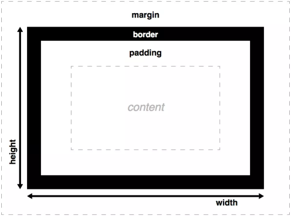

# 层叠样式表

## 盒子模型

围绕元素内容添加任何内边距、边界和外边距来布置单个元素盒子




## 层叠与继承

元素的最终样式可以在多个地方定义，它们以复杂的形式相互影响。

项目       |描述
-----------|--------
层叠重量级  |1. 重要性：!important；<br/>2. 专用性：衡量选择器的具体程度的一种方法——它能匹配多少元素；<br/>3. 源代码次序；<br/>!important >> style属性 >> ID选择器 >> 类选择器 >> 伪元素选择器 >> 元素选择器
控制继承    |1. inherit：继承父元素可继承属性;<br/>2. initial：设置为浏览器默认值/如果浏览器默认样式表中没有设置值，并且该属性是自然继承的，那么该属性值就被设置为 inherit;<br/>3. unset：该值将属性重置为其自然值，即如果属性是自然继承的，那么它就表现得像 inherit，否则就是表现得像 initial;<br/>4. revert：如果当前的节点没有应用任何样式，则将该属性恢复到它所拥有的值。换句话说，属性值被设置成自定义样式所定义的属性（如果被设置）， 否则属性值被设置成用户代理的默认样式。

## BFC 格式化上下文

形成BFC条件       |BFC特性
-----------------|--------
1、浮动元素，float 除 none 以外的值；<br/>2、定位元素，position（absolute，fixed）；<br/>3、display 为以下其中之一的值 inline-block，table-cell，table-caption <br/>4、overflow 除了 visible 以外的值（hidden，auto，scroll）；|1. 内部的Box会在垂直方向上一个接一个的放置。<br/>2. 垂直方向上的距离由margin决定<br/>3. bfc的区域不会与float的元素区域重叠。<br/>4. 计算bfc的高度时，浮动元素也参与计算<br/>5. bfc就是页面上的一个独立容器，容器里面的子元素不会影响外面元素。

## 特性

特性            |描述
----------------|---------
包含块          |包含块就是这个元素最近的父块元素(依赖于这个元素的position属性)的内容区。 
外边距合并(折叠) |1. 毗邻的两个元素之间的*外边距*会合并;<br/>2. 父子元素之间，父元素不含border、padding以及行内元素，首尾子元素与父元素外边框合并，且子元素外边距溢出；<br/> 3. 空的块级元素*上下外边距*合并。
box-sizing      |更改用于计算元素宽度和高度的盒模型:<br/>1. content-box: 标准盒模型；<br/>2. border-box: IE盒模型 width/height = border + padding + 内容的宽度/高度 (如果想要使一个框占窗口的50%可以使用)。
布局            |1. float：元素**脱离**正常的文档布局流，并吸附到其父容器，位于该浮动元素之下的内容，此时会围绕着浮动元素，填满;<br/>2. position：从正常的文档流布局中**取出**元素，可与其他元素**重叠**。如：static(静态定位)、relative(相对定位)、absolute(绝对定位)、fixed(固定定位)、sticky(粘性定位)；<br/>3. flex：弹性布局:<br/><p style="overflow: hidden;"> a. 设置父容器display: flex；<br/>b. 设置主轴方向；<br/>c. 设置动态尺寸；<br/>d. 设置项排序；<br/>e. 优化设置换行与对齐方式。</p>4. table:参考表格属性<br/>5. grid:本地CSS网格布局，集合定宽网格布局、流体网格布局、浮动网格布局和第三网格布局的优缺点，无需计算、引用和设置类标记，仅需通过属性便可确定搞定网格布局。
定位居中        |1. absolute+left&&top: 50%+margin减去宽高1/2;<br/>2.absolute+left&&right&&top&&bottom: 0+margin: auto;<br/>3. absolute+left&&top: 50%+transfrom: translate(-50%,-50%);<br/>4. table-cell+vertical-align: middle+text-align: center;<br/>5.flex+justify-content: center+align-items:center

## 动画 Animation.css

```html
    <!-- 加载&&使用 Animation -->
    <link rel="stylesheet" href="animate.min.css">
    ...
    <h1 calss="animated animateClassName">示例</h1>
```

```json
    /**
     * 打包 Animation
     */

    //webpack.config.js
    entry: {
        'main': [
            'animate-css-webpack!./src/animate-css.config.js',
            './src/app.js',
        ]
    }
    // animate-css.config.js
    "attention_seekers": {
        "bounce": true,
        "flash": false
    }
```

ClassName               |描述
------------------------|---------
delay-2s                |Delay Time 2s(可选值 2~5s)
slow/slower/fast/faster |2s/3s/800ms/500ms
Attention Seekers       |引导注意力--
Bouncing Entrances/Exits|弹跳进/出
Fading Entrances/Exits  |渐变进/出
Flippers                |翻转
Lightspeed              |飞速进/出
Rotating Entrances/Exits|旋转进/出
Sliding Entrances/Exits |滑动进/出
Zoom Entrances/Exits    |变焦进/出
Specials                |高阶用法

## 工程化

Css结构 |描述
--------|---------
Base    |基础样式表：定义了基本的样式，我们平时写CSS比如reset.css就是属于基础样式表，另外我认为清除浮动，一些动画也可以归类为基础样式。
Layout  |布局样式：用于实现网页的基本布局，搭起整个网页的基本骨架。
Module  |网页中不同的区域有这个不同的功能，这些功能是相对独立的，我们可以称其为模块。模块是独立的，可重用的组件，它们不依赖于布局组件，可以安全的删除修改而不影响其他模块。
Components|组件样式：
State   |状态样式：通常和js一起配合使用，表示某个组件或功能不同的状态，比如菜单选中状态，按钮不可用状态等。
Theme   |主题皮肤：对于可更换皮肤的站点来说，这个是很有必要的，分离了结构和皮肤，根据不同的皮肤应用不同的样式文件。

命名规则       |适用        |描述
---------------|-----------|---------
基于功能命名    |组件化     |描述做什么
基于内容命名    |结构化     |描述包揽什么
基于视觉命名    |语义化     |描述像什么

Css预处理 Less

```html
    <script>
    less = {
        env: "development",
        async: false,
        fileAsync: false,
        poll: 1000,
        functions: {},
        dumpLineNumbers: "comments",
        relativeUrls: false,
        rootpath: ":/a.com/"
    };
    </script>
    <script src="less.js"></script>
```

