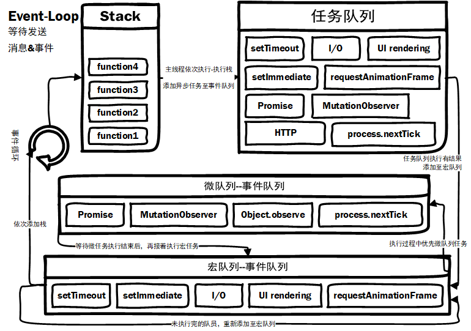
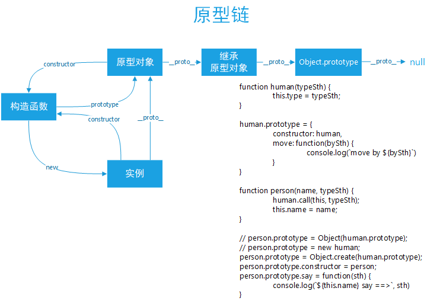

# JavaScript基石篇

## 基础语法

数据类型    |变量类型   |typeof         |补充描述
------------|----------|---------------|----------
String      |字符串值   |"string"       |
Number      |数值       |"number"       |
Boolean     |布尔值     |"boolean"      |
Array       |数组       |"array"        |
Object      |对象       |"object"       |
Null        |null       |"object"       |一个字面量，尚未创建的对象
Undefined   |undefined  |"undefined"    |一个声明未定义的变量的初始值，或没有实际参数的形式参数
Function    |function   |"function"     |

内置对象    |补充描述
------------|----------
Date        |1. getFullYear;2. getMonth() + 1;3. getDay;4. getHours;5. getMinutes;6. getSeconds; 7. getMilliseconds;
Array       |1. concat: 数组拼接;2. join: 数组连接;3. pop: 移除最后一个;4. shift:移除第一个;5. slice:拷贝指定范围元素;6. push:新添元素;7. sort:数组排序;8. reverse:反转数组;
JSON        |
RegExp      |
String      |1. charAt:返回指定索引的位置的字符;2. match：正则匹配;3. replace：替换;4. search：指明是否存在相应的匹配;5. slice：返回字符段片段;6. split：字符串拆分;7. substr：字符串截取;8. substring：取得指定长度内的字符串;9. toUpperCase：大写转化;10. toLowerCase：小写转化;
Global      |1. Math;2. escape;3. isNaN;4. parseInt;

## 堆&&栈

内存空间    |分配空间位置   |分配大小   |存放对象
------------|----------|--------|---------
堆(heap)    |任意存放   |每个进程分配一个heap，大小根据需要|array对象、object对象
栈(stack)   |次序存放(后进先出) |每个线程分配一个stack，大小受限|一些基本类型的变量和对象的引用

## Event-Loop



异步任务|#                      |浏览器  |Node
-------|-----------------------|--------|---------
宏任务  |I/O                    |√      |√
宏任务  |setTimeout/setInterval |√      |√
宏任务  |setImmediate           |**×**  |√
宏任务  |request                |√      |√
宏任务  |requestAnimationFrame  |√      |**×**
微任务  |process.nextTick       |**×**  |√
微任务  |MutationObserver       |√      |**×**
微任务  |Promise.then catch finally |√  |√

## 函数&&原型链



## 作用域&&上下文

### 执行上下文

### 作用域

### 变量提升

将变量和函数的声明会在编辑阶段放到代码的最前面。其最大的优点，可以在物理代码声明一个函数/变量之前提前使用它，相比函数比变量优先提升。

```JavaScript
    name = 'World!';
    var name;// 仅提升声明，而不提升初始化
    (function () {
        if (typeof name === 'undefined') {
            var name = 'Jack';
            console.log('Goodbye ' + name);
        } else {
            console.log('Hello ' + name);
        }
    })();
```

## 事件&&自定义事件

HTML元素事件由浏览器内在产生，当事件发生时向该事件订阅者发出事件描述

* DOM事件流:
    1. 用户行为：DOM是颗树形结构，每当HTML元素A产生事件B时，B事件就会在树的根节点与A元素节点之间传播，所有经过的节点都会收到该事件描述；
    2. 浏览器行为：资源加载状态、页面关闭等。
* DOM事件模型:
    1. 冒泡型事件处理模型(Bubbling):DOM事件由叶子节点往根节点传播;
    2. 捕获型事件处理模型(Captrue):DOM事件由根节点往叶子节点传播;
    3. 标准的事件处理模型:<br/>
        父元素中所有的捕捉型事件（如果有）自上而下地执行;<br/>
        目标元素的冒泡型事件（如果有）;<br/>
        父元素中所有的冒泡型事件（如果有）自下而上地执行;
* DOM事件处理：
    
* 事件对象：
    事件对象     |描述
    ------------|-------------
    event.target|指的是触发事件的那个节点，也就是事件最初发生的节点。
    event.target.matches|可以对关键节点进行匹配，来执行相应操作。
    event.currentTarget|指的是正在执行的监听函数的那个节点。
    event.isTrusted|表示事件是否是真实用户触发。
    event.preventDefault()|取消事件的默认行为。
    event.stopPropagation()|阻止事件的派发（包括了捕获和冒泡）。
    event.stopImmediatePropagation()|阻止同一个事件的其他监听函数被调用。

```javascript
    /**
     * 自定义事件
     */
    let event = new Event('eventName');
    // let event = new CustomEvent('eventName', { 'detail': ...});

    // 监听该事件；
    element.addEventListener('eventName', (e) => {}, false);

    // 触发该事件；
    element.dispatchEvent(event);
```

## new

## 闭包

* 闭包就是在另一个作用域中保存了一份它从上一级函数或者作用域得到的变量，而这些变量是不会随上一级函数的执行完成而销毁。
* 用途:
    1. 读取函数内部的变量;
    2. 变量的值始终保持在内存中.

## DOM(Document Object Model)对象

DOM 定义了访问HTML文档的一套属性、方法和事件标准，是HTML与脚本语言沟通的桥梁。


DOM对象     |描述
-----------|--------
文档对象    |整个HTML文档
节点对象    |所有HTML元素
属性对象    |依附于元素节点，所有节点的属性都是节点
文本对象    |HTML元素内的文本

## BOM对象

BOM对象     |描述
-----------|--------
window  |表示浏览器窗口，全局变量是window对象的属性，全局方法是window对象的方法。
screen  |
location|
history |
navigator|包含有关访问者浏览器的信息
弹窗    |alert、prompt(提示框)、confirm(确认框)
存储    |cookie、localstorage
