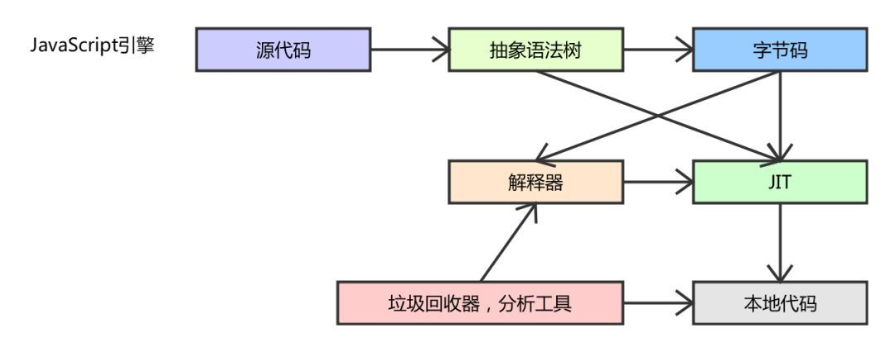
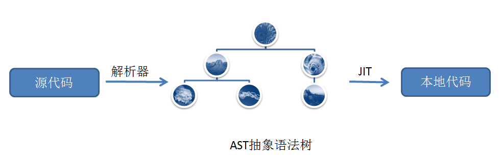

# Js引擎

专门处理JavaScript(ECMAScript)脚本的虚拟机--通过一系列手段将代码剖析后运行起来

主流浏览器|内核|Js引擎
---------|----|------
IE -> Edge|trident->EdgeHTML|JScript（IE3.0-IE8.0）/ Chakra(IE9+)
Chrome|webkit->blink|ChromeV8（大名鼎鼎）
Safari|webkit|Nitro（4-)
Firefox|Gecko|SpiderMonkey（1.0-3.0）/ TraceMonkey（3.5-3.6）/ JaegerMonkey（4.0-）
Opera|Presto->blink|Linear A（4.0-6.1）/ Linear B（7.0-9.2）/ Futhark（9.5-10.2）/ Carakan（10.5-）

## 语法检查

1. 词法分析: 解释器先把JavaScript代码（字符串）的字符流按照ECMAScript标准转换为记号流。
2. 语法分析: 语法分析器在经过词法分析后，将记号流按照ECMAScript标准把词法分析所产生的记号生成语法树，一个由元素逐级嵌套所组成的代表了程序语法结构的树--抽象语法树（Abstract Syntax Tree，AST）。

## 运行阶段

### 预编译

1. 创建基础的执行上下文：JavaScript引擎将语法检查正确后生成的语法树（AST）复制到当前执行上下文中;
2. 属性填充：JavaScript引擎会对语法树（AST）当中的变量声明、函数声明以及函数的形参进行属性填充;

注：
执行上下文类型|描述
------------|--------
全局执行上下文|这是基础的上下文，任何不在函数内部的代码都在全局上下文中： 1. 创建一个全局的 window/Global 对象; 2. 设置 this 的值等于这个全局对象;
函数执行上下文|每当一个函数被调用时, 都会为该函数创建一个新的上下文
Eval 函数执行上下文|
变量对象    |Variable Object：变量对象、函数声明、参数
作用域链    |Scope Chain：变量对象以及所有父级作用域（所有父级=父级 + 父级的父级）
this        |this Value：content Object

### 执行

1. **声明提前**(hoisting):指的是JavaScript会默认将声明移到作用域顶部。意味着我们可以在声明前就使用。
    * 变量声明: 将 var 声明的变量提前到顶部，赋值留在原处。
    * 函数声明: 将 function 声明的函数的名称和函数体都提前。
    变量声明 > 函数声明 > 属性填充

    

2. 创建阶段:
    1. this 值的决定:

        执行上下文类型|描述
        -------------|--------
        全局执行上下文|this 的值指向全局对象;
        函数执行上下文|this 的值取决于该函数是如何被调用的。 如果它被一个引用对象调用，那么 this 会被设置成那个对象，否则 this 的值被设置为全局对象或者 undefined

    2. 创建**词法环境**组件: 词法环境是一种规范类型，基于 ECMAScript 代码的词法嵌套结构来定义标识符和具体变量和函数的关联;

        词法环境的内部组件|描述
        -------------|--------
        环境记录器|存储变量和函数声明的实际位置
        外部环境的引用|意味着它可以访问其父级词法环境（作用域）

        词法环境的内部类型|描述
        -------------|--------
        全局环境|在全局执行上下文中是没有外部环境引用的词法环境。全局环境的外部环境引用是 null。它拥有内建的 Object/Array/等、在环境记录器内的原型函数（关联全局对象，比如 window 对象）还有任何用户定义的全局变量，并且 this的值指向全局对象
        函数环境|函数内部用户定义的变量存储在环境记录器中。并且引用的外部环境可能是全局环境，或者任何包含此内部函数的外部函数

    3. 创建**变量环境**组件: 同样是一个词法环境，其环境记录器持有变量声明语句在执行上下文中创建的绑定关系
3. 执行阶段: 完成对所有这些变量的分配，最后执行代码
    1. **同步任务**: 主线程上排队执行的任务;
    2. **异步任务**: 不进入主线程，而进入任务队列的任务，只有任务队列callback主线程，某个异步任务可以执行了，它才会进入主线程;

作用域(scope)|指变量的可访问性。
全局作用域  |全局作用域内的变量可以在任何其他作用域内访问和修改；
局部作用域  |函数内定义的变量可以在局部（本地）作用域内访问和修改;条件语句(if 和 switch)&循环语句(for 和 while)不会创建一个新的作用域。
变量作用域  |
函数作用域  |变量在声明他们的函数体以及这个函数体嵌套的任意函数体内都是有定义的

上下文(context)|

执行器上下文
