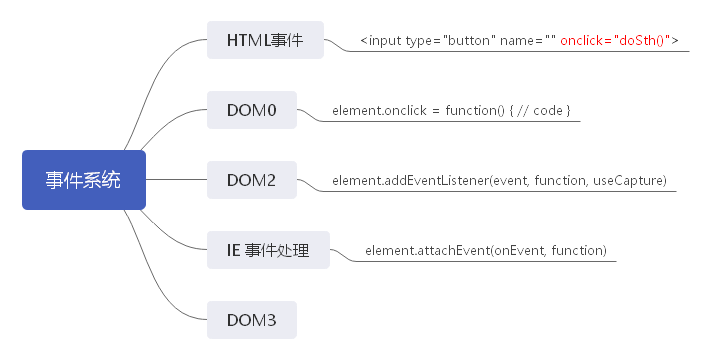
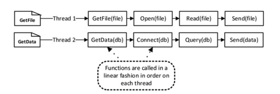
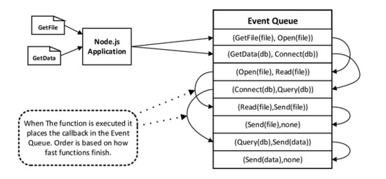
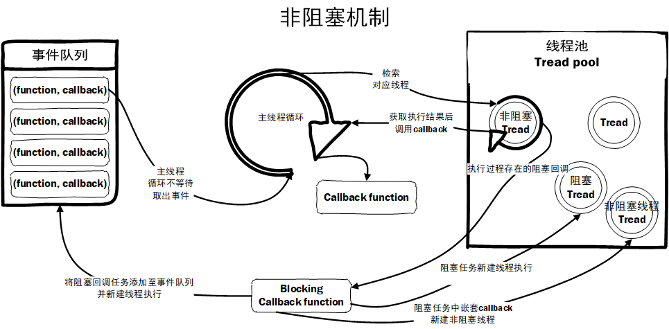

# 事件驱动&异步回调

**程序是如何响应事件**：

1. 中断：操作系统处理键盘等硬件输入就是通过中断来进行的，这个方式的好处是即使没有多线程，我们也可以放心地执行我们的代码，CPU收到中断信号之后自动地转去执行相应的中断处理程序，处理完成后会恢复原来的代码的执行环境继续执行；
2. 轮询：循环检测是否有事件发生，如果有就分发，调用相应的回调函数进行处理。

## 浏览器事件驱动思维

事件驱动思维：用户输入 => 事件响应 => 代码运行 => 刷新页面状态

1. 开发静态页面；
2. 添加事件监听，包括用户输入、http请求、定时器触发等事件；
3. 针对不同事件，编写不同的处理逻辑，包括获取事件状态/输入、计算并更新状态等；
4. 根据计算后的数据状态，重新渲染页面。

### 浏览器事件

事件是可以被控件识别的操作，如按下确定按钮，选择某个单选按钮或者复选框。每一种控件有自己可以识别的事件，如窗体的加载、单击、双击等事件，编辑框（文本框）的文本改变事件，等等。

事件（event）是针对应用程序所发生的事情，并且应用程序需要对这种事情做出响应。

### 浏览器事件驱动处理

1. 构建页面：设计DOM => 生成DOM => 绑定事件
2. 监听事件：操作UI => 触发事件 => 响应处理 => 更新UI

## Node 事件驱动

Node采用事件驱动的运行方式的**单线程单进程应用**。

事件驱动是建立在事件驱动模型基础之上的。

### 传统线程网络模型

传统线程网络模型：处理任务时会在线程池(Tread Loop)中分配一个线程来**线性同步**完成任务。

### Node事件驱动模型

在事件驱动的模型当中，每一个异步工作被添加到**事件队列**中，**主循环线程**循环地处理队列上的工作任务，当执行过程中遇到来堵塞(读取文件、查询数据库)任务时，主循环线程不会停下来等待结果，而是留下一个处理结果的回调函数，转而继续执行队列中的下一个任务。
这个传递到队列中的回调函数在堵塞任务运行结束后才被线程调用。

## Node事件驱动思维

概念很简单：触发器触发事件，该事件对应的监听函数被调用。也就是说，触发器有两个特征：

* 触发某个事件
* 注册／注销监听函数

## 阻塞/非阻塞

传统线程网络模型是阻塞的，弊端:

1. 线程池中线程个数有限，容易出现新任务请求的等待，严重会宕机;
2. 为保障数据的准确性，事务&锁造成等待，导致线程占用资源，效能低下。

事件驱动模型是非阻塞的

1. 采用事件回调使主线程避开堆阻塞线程的等待;
2. 阻塞任务，在线程池获取一个线程，将阻塞任务在此执行，形成等待线程，并将回调函数添加到事件队列中。

## 阻塞/非阻塞|异步/同步|并发/并行

项目    |区别
--------|-------
阻塞    |线程操作采用线性网络模型，当前线程操作的数据未就绪，当前与后续线程需等待
非阻塞  |线程操作采用事件驱动模型，主线程操作轮询任务队列，当前与否需任务无需等待
同步    |任务必须一件一件依次的执行，下一任务需等待上一任务执行完毕，**同步不代表阻塞，但阻塞肯定是同步**
异步    |任务无需依次执行
并发    |当有多个线程在操作时，如果系统只有一个CPU，操作系统只能把CPU运行时间划分成若干个时间段,再将时间段分配给各个线程执行，在一个时间段的快速的切换不同的线程代码运行
并行    |当系统有多个CPU时，可以存在当一个CPU执行一个线程时，另一个CPU可以执行另一个线程，两个线程互不抢占CPU资源，可以同时进行
