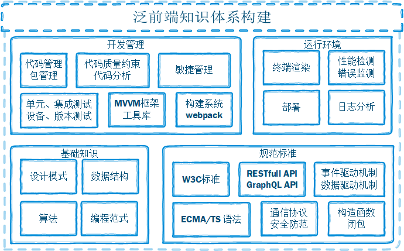

# 泛前端知识体系构建

## 前言

**知识体系：**

早期是把一些零碎的、分散的、相对独立的知识概念或观点加以整合，使之形成具有一定联系的知识系统。

当代互联网数据大爆炸的时代，知识已不再是以“点状”或者“树状”的形态呈现，而是变成了一张密密麻麻纵横交错的“网”。

通过这张网状知识点之间的相互引用作证，究其根本、知其所以然。

## 基石篇

## 中级应用篇

## 高级架构篇
